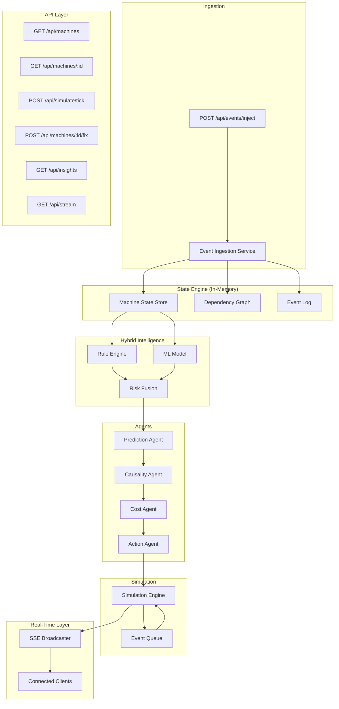

# GearShift — Backend Implementation Plan

> **AI-Native Industrial Control Tower with Hybrid Intelligence + Simulation Engine**
> Hackathon build target: **24 hours**  |  Stack: **Next.js App Router, Node.js, Supabase (PostgreSQL), SSE, Groq LLM, PixiJS (frontend)**

---

## ✅ Confirmed Stack Decisions

> [!NOTE]
> All key architecture decisions are locked in:
> 1. **ML Model** — Hardcoded logistic regression coefficients. Zero runtime dependencies, sub-microsecond compute.
> 2. **LLM Provider** — **Groq API** with model `llama-3.3-70b-versatile`. Ultra-fast inference (~300 tokens/sec). Used only for explanations, never core logic.
> 3. **Database** — **Supabase (PostgreSQL)**. Persists state across serverless cold starts and deploys. In-memory cache layer sits on top for hot-path speed.
> 4. **Real-time** — SSE via `GET /api/stream`. Supabase Realtime as fallback broadcast channel.
> 5. **Frontend scope** — API + SSE contract only. PixiJS rendering handled by frontend team.

---

## 1. Architecture Overview



### Design Principles

| Principle | Decision |
|---|---|
| State management | **Supabase (PostgreSQL)** as source of truth + in-memory cache for hot reads |
| Concurrency | Single-threaded event loop — no locks needed |
| Simulation | Discrete-event with tick-based progression |
| ML | Hardcoded logistic regression coefficients (no runtime dependency) |
| LLM | **Groq API** — `llama-3.3-70b-versatile` — explanations only |
| Real-time | Server-Sent Events (simpler than WebSockets for Vercel) |
| Serialization | JSON over HTTP |

---

## 2. Folder Structure

```
forgex/
├── .gitignore
├── package.json
├── tsconfig.json
├── next.config.ts
├── README.md
│
├── src/
│   ├── app/
│   │   ├── layout.tsx                     # Root layout
│   │   ├── page.tsx                       # Dashboard shell (minimal)
│   │   │
│   │   └── api/
│   │       ├── machines/
│   │       │   ├── route.ts               # GET /api/machines
│   │       │   └── [id]/
│   │       │       ├── route.ts           # GET /api/machines/:id
│   │       │       └── fix/
│   │       │           └── route.ts       # POST /api/machines/:id/fix
│   │       │
│   │       ├── events/
│   │       │   └── inject/
│   │       │       └── route.ts           # POST /api/events/inject
│   │       │
│   │       ├── simulate/
│   │       │   └── tick/
│   │       │       └── route.ts           # POST /api/simulate/tick
│   │       │
│   │       ├── insights/
│   │       │   └── route.ts              # GET /api/insights
│   │       │
│   │       └── stream/
│   │           └── route.ts              # GET /api/stream (SSE)
│   │
│   ├── core/
│   │   ├── state/
│   │   │   ├── store.ts                  # In-memory cache (hot reads)
│   │   │   ├── machine-store.ts          # Machine CRUD + state transitions
│   │   │   └── graph-store.ts            # Dependency graph operations
│   │   │
│   │   ├── engine/
│   │   │   ├── event-ingestion.ts        # Event processing pipeline
│   │   │   ├── rule-engine.ts            # Deterministic risk rules
│   │   │   ├── ml-model.ts              # Hardcoded logistic regression
│   │   │   ├── risk-fusion.ts           # Weighted combination
│   │   │   └── simulation-engine.ts     # Discrete-event simulation loop
│   │   │
│   │   ├── agents/
│   │   │   ├── agent-orchestrator.ts    # Pipeline coordinator
│   │   │   ├── prediction-agent.ts      # Risk computation
│   │   │   ├── causality-agent.ts       # Graph propagation
│   │   │   ├── cost-agent.ts            # Financial impact
│   │   │   └── action-agent.ts          # Decision + fix logic
│   │   │
│   │   ├── realtime/
│   │   │   └── sse-manager.ts           # SSE connection manager + broadcast
│   │   │
│   │   └── llm/
│   │       └── explanation-service.ts   # Groq API — llama-3.3-70b-versatile
│   │
│   ├── db/
│   │   ├── supabase.ts                  # Supabase client singleton
│   │   ├── machines.db.ts               # Machine DB read/write helpers
│   │   ├── events.db.ts                 # Event log persistence
│   │   ├── actions.db.ts                # Action recommendations persistence
│   │   └── simulation.db.ts             # Simulation state + snapshots
│   │
│   ├── models/
│   │   ├── machine.ts                   # Machine type + factory
│   │   ├── event.ts                     # Event types + enums
│   │   ├── connection.ts                # Dependency edge type
│   │   ├── simulation.ts               # Simulation state types
│   │   └── action.ts                   # Action recommendation types
│   │
│   ├── data/
│   │   ├── seed-machines.ts             # Initial machine fleet
│   │   └── seed-connections.ts          # Initial dependency graph
│   │
│   └── lib/
│       ├── constants.ts                 # Thresholds, weights, config
│       └── utils.ts                     # Helpers (clamp, uuid, etc.)
│
└── scripts/
    └── seed-db.ts                       # One-time Supabase seed script
```

---

## 3. Data Models (TypeScript)

### 3.1 Machine

```typescript
// src/models/machine.ts

export type MachineStatus = 'HEALTHY' | 'WARNING' | 'CRITICAL' | 'FAILED';

export interface Machine {
  id: string;
  name: string;
  type: 'pump' | 'compressor' | 'conveyor' | 'generator' | 'turbine' | 'heat-exchanger';
  status: MachineStatus;

  // Sensor readings
  temperature: number;    // °C — normal: 40-70, warning: 70-90, critical: 90+
  vibration: number;      // mm/s — normal: 0-4, warning: 4-7, critical: 7+
  load: number;           // % — normal: 0-60, warning: 60-80, critical: 80+

  // Risk scores (0-1)
  ruleRisk: number;
  mlRisk: number;
  finalRisk: number;

  // Derived
  failureProbability: number;  // 0-1
  timeToFailure: number;       // hours (estimated)

  // Graph
  connections: string[];  // IDs of dependents

  // Position (for frontend rendering)
  position: { x: number; y: number };

  // Metadata
  lastUpdated: number;    // timestamp
  history: SensorSnapshot[];
}

export interface SensorSnapshot {
  timestamp: number;
  temperature: number;
  vibration: number;
  load: number;
  risk: number;
}
```

### 3.2 Connection (Dependency Edge)

```typescript
// src/models/connection.ts

export interface Connection {
  id: string;
  sourceId: string;
  targetId: string;
  dependencyStrength: number;  // 0-1 — how strongly source impacts target
  type: 'power' | 'cooling' | 'material' | 'control';
}
```

### 3.3 Event

```typescript
// src/models/event.ts

export type EventType =
  | 'SENSOR_UPDATE'
  | 'USER_INJECTED_EVENT'
  | 'ANOMALY'
  | 'FAILURE'
  | 'FIX_ACTION'
  | 'SIMULATION_TICK'
  | 'CASCADE_PROPAGATION';

export interface SystemEvent {
  id: string;
  type: EventType;
  machineId: string;
  timestamp: number;
  payload: Record<string, unknown>;
  source: 'system' | 'user' | 'simulation' | 'agent';
}
```

### 3.4 Simulation

```typescript
// src/models/simulation.ts

export interface SimulationState {
  isRunning: boolean;
  currentTick: number;
  tickIntervalMs: number;     // default: 1000 (1 second = 1 sim-hour)
  speed: number;              // multiplier: 1x, 2x, 5x
  eventQueue: ScheduledEvent[];
  history: SimulationSnapshot[];
}

export interface ScheduledEvent {
  event: SystemEvent;
  executeAtTick: number;
}

export interface SimulationSnapshot {
  tick: number;
  timestamp: number;
  machineStates: Record<string, {
    status: MachineStatus;
    finalRisk: number;
    temperature: number;
    vibration: number;
    load: number;
  }>;
}
```

### 3.5 Action

```typescript
// src/models/action.ts

export type ActionType = 'FIX_NOW' | 'SCHEDULE' | 'MONITOR' | 'ESCALATE';
export type ActionPriority = 'LOW' | 'MEDIUM' | 'HIGH' | 'CRITICAL';

export interface ActionRecommendation {
  id: string;
  machineId: string;
  action: ActionType;
  priority: ActionPriority;
  reason: string;
  estimatedCost: number;         // cost if NOT acted upon
  estimatedSavings: number;       // savings if acted upon NOW
  deadline: number;               // ticks until too late
  createdAt: number;
  executed: boolean;
}
```

---

## 4. Module Design — Deep Dive

### 4.1 State Engine (`src/core/state/store.ts`)

The singleton store holds ALL mutable state. Every other module reads/writes through this interface.

```typescript
// Singleton pattern — survives across requests in same serverless instance
class GlobalStore {
  machines: Map<string, Machine> = new Map();
  connections: Connection[] = [];
  events: SystemEvent[] = [];
  actions: ActionRecommendation[] = [];
  simulation: SimulationState = {
    isRunning: false,
    currentTick: 0,
    tickIntervalMs: 1000,
    speed: 1,
    eventQueue: [],
    history: [],
  };

  // SSE clients
  sseClients: Set<ReadableStreamController> = new Set();

  // Initialization flag
  initialized: boolean = false;
}

// Module-level singleton
export const store = new GlobalStore();
```

**Machine Store** exposes:
- `getMachine(id)` / `getAllMachines()`
- `updateMachine(id, partial)` — triggers risk recalc + SSE broadcast
- `transitionStatus(id)` — applies status rules based on `finalRisk`
- `resetMachine(id)` — used by FIX_ACTION

**Graph Store** exposes:
- `getDependents(machineId)` — returns machines that depend on this one
- `getDependencies(machineId)` — returns machines this one depends on
- `getImpactPath(machineId)` — BFS/DFS to find full cascade chain
- `getConnectionStrength(sourceId, targetId)`

### 4.2 Event Ingestion (`src/core/engine/event-ingestion.ts`)

```
          ┌─────────────────────┐
          │   Incoming Event    │
          └─────────┬───────────┘
                    │
          ┌─────────▼───────────┐
          │  Validate + Enrich  │
          │   (add id, ts)      │
          └─────────┬───────────┘
                    │
          ┌─────────▼───────────┐
          │   Route by Type     │
          └─────────┬───────────┘
                    │
    ┌───────────────┼────────────────┐
    │               │                │
SENSOR_UPDATE   USER_INJECTED   FIX_ACTION
    │               │                │
    ▼               ▼                ▼
Update sensors  Apply effect    Reset machine
    │               │                │
    └───────────────┼────────────────┘
                    │
          ┌─────────▼───────────┐
          │  Agent Orchestrator │
          │  (full pipeline)    │
          └─────────────────────┘
```

**Key logic:**

```typescript
export function processEvent(event: SystemEvent): void {
  // 1. Log
  store.events.push(event);

  // 2. Route
  switch (event.type) {
    case 'SENSOR_UPDATE':
      applySensorUpdate(event);
      break;
    case 'USER_INJECTED_EVENT':
      applyInjectedEvent(event);
      break;
    case 'FIX_ACTION':
      applyFix(event);
      break;
    // ...
  }

  // 3. Run full agent pipeline on affected machine
  orchestrator.run(event.machineId);

  // 4. Broadcast state change
  broadcastState();
}
```

### 4.3 Rule Engine (`src/core/engine/rule-engine.ts`)

Deterministic, fast, transparent.

```typescript
export function computeRuleRisk(machine: Machine): number {
  let risk = 0;

  // Temperature rules
  if (machine.temperature > 95) risk += 0.4;
  else if (machine.temperature > 85) risk += 0.25;
  else if (machine.temperature > 75) risk += 0.1;

  // Vibration rules
  if (machine.vibration > 8) risk += 0.35;
  else if (machine.vibration > 6) risk += 0.2;
  else if (machine.vibration > 4) risk += 0.1;

  // Load rules
  if (machine.load > 90) risk += 0.25;
  else if (machine.load > 75) risk += 0.15;
  else if (machine.load > 60) risk += 0.05;

  // Compound multiplier: multiple high readings are exponentially worse
  const highCount = [
    machine.temperature > 85,
    machine.vibration > 6,
    machine.load > 75,
  ].filter(Boolean).length;

  if (highCount >= 3) risk *= 1.5;
  else if (highCount >= 2) risk *= 1.2;

  return Math.min(risk, 1.0);
}
```

### 4.4 ML Model (`src/core/engine/ml-model.ts`)

Hardcoded logistic regression. Coefficients pre-computed from synthetic data.

```typescript
// Pre-trained coefficients (logistic regression)
const COEFFICIENTS = {
  intercept: -4.5,
  temperature: 0.045,   // per °C above baseline
  vibration: 0.35,      // per mm/s
  load: 0.025,          // per %
};

function sigmoid(x: number): number {
  return 1 / (1 + Math.exp(-x));
}

export function computeMLRisk(machine: Machine): number {
  const z =
    COEFFICIENTS.intercept +
    COEFFICIENTS.temperature * machine.temperature +
    COEFFICIENTS.vibration * machine.vibration +
    COEFFICIENTS.load * machine.load;

  return sigmoid(z);
}
```

**Why this works for hackathon:**
- Zero dependencies
- Instant computation
- Outputs 0-1 probability
- Coefficients are tuned to produce reasonable outputs for typical sensor ranges

### 4.5 Risk Fusion (`src/core/engine/risk-fusion.ts`)

```typescript
const RULE_WEIGHT = 0.6;
const ML_WEIGHT = 0.4;

export function fuseRisk(ruleRisk: number, mlRisk: number): number {
  return (RULE_WEIGHT * ruleRisk) + (ML_WEIGHT * mlRisk);
}

export function estimateTimeToFailure(finalRisk: number): number {
  // Higher risk = less time
  // Risk 1.0 → 0 hours, Risk 0.0 → 168 hours (1 week)
  if (finalRisk >= 0.95) return 0;
  return Math.max(0, Math.round(168 * (1 - finalRisk)));
}

export function deriveStatus(finalRisk: number): MachineStatus {
  if (finalRisk >= 0.85) return 'FAILED';
  if (finalRisk >= 0.6)  return 'CRITICAL';
  if (finalRisk >= 0.35) return 'WARNING';
  return 'HEALTHY';
}
```

### 4.6 Agent Orchestrator (`src/core/agents/agent-orchestrator.ts`)

Sequential pipeline — each agent feeds the next.

```
┌───────────────┐    ┌───────────────┐    ┌───────────────┐    ┌───────────────┐
│  Prediction   │───▶│   Causality   │───▶│     Cost      │───▶│    Action     │
│    Agent      │    │    Agent      │    │    Agent      │    │    Agent      │
└───────────────┘    └───────────────┘    └───────────────┘    └───────────────┘
     │                     │                    │                    │
  ruleRisk            propagated            costEstimate        recommendation
  mlRisk              impacts               savings             action type
  finalRisk           affected IDs          deadline
```

```typescript
export class AgentOrchestrator {
  run(machineId: string): void {
    // Phase 1: Prediction
    const prediction = predictionAgent.compute(machineId);

    // Phase 2: Causality — propagate risk downstream
    const impacts = causalityAgent.propagate(machineId);

    // Phase 3: Cost — quantify financial impact
    const costAnalysis = costAgent.analyze(machineId, impacts);

    // Phase 4: Action — decide what to do
    const action = actionAgent.decide(machineId, prediction, costAnalysis);

    // Store action if generated
    if (action) {
      store.actions.push(action);
    }
  }
}
```

### 4.7 Prediction Agent

```typescript
export class PredictionAgent {
  compute(machineId: string): PredictionResult {
    const machine = store.machines.get(machineId)!;

    const ruleRisk = computeRuleRisk(machine);
    const mlRisk = computeMLRisk(machine);
    const finalRisk = fuseRisk(ruleRisk, mlRisk);
    const timeToFailure = estimateTimeToFailure(finalRisk);
    const status = deriveStatus(finalRisk);

    // Update machine state
    updateMachine(machineId, {
      ruleRisk,
      mlRisk,
      finalRisk,
      failureProbability: finalRisk,
      timeToFailure,
      status,
    });

    return { machineId, ruleRisk, mlRisk, finalRisk, timeToFailure, status };
  }
}
```

### 4.8 Causality Agent (Graph Propagation)

This is the most architecturally interesting module. It uses **BFS** to propagate risk through the dependency graph.

```typescript
export class CausalityAgent {
  propagate(sourceMachineId: string): CausalityImpact[] {
    const source = store.machines.get(sourceMachineId)!;
    const impacts: CausalityImpact[] = [];

    // Only propagate if source is at meaningful risk
    if (source.finalRisk < 0.3) return impacts;

    // BFS through dependency graph
    const visited = new Set<string>([sourceMachineId]);
    const queue: { machineId: string; incomingRisk: number; depth: number }[] = [];

    // Seed queue with direct dependents
    const directDependents = getConnectionsFrom(sourceMachineId);
    for (const conn of directDependents) {
      queue.push({
        machineId: conn.targetId,
        incomingRisk: source.finalRisk * conn.dependencyStrength,
        depth: 1,
      });
    }

    while (queue.length > 0) {
      const { machineId, incomingRisk, depth } = queue.shift()!;

      if (visited.has(machineId)) continue;
      visited.add(machineId);

      // Attenuate risk with depth (prevents runaway cascades)
      const attenuatedRisk = incomingRisk * Math.pow(0.7, depth - 1);

      if (attenuatedRisk < 0.05) continue; // below noise floor

      const target = store.machines.get(machineId)!;

      // Apply propagated risk (additive, capped at 1.0)
      const newRisk = Math.min(1.0, target.finalRisk + attenuatedRisk * 0.5);

      impacts.push({
        machineId,
        previousRisk: target.finalRisk,
        addedRisk: attenuatedRisk * 0.5,
        newRisk,
        depth,
        sourceChain: [sourceMachineId],
      });

      // Update target
      updateMachine(machineId, {
        finalRisk: newRisk,
        status: deriveStatus(newRisk),
        timeToFailure: estimateTimeToFailure(newRisk),
      });

      // Continue propagation to next level
      const nextDependents = getConnectionsFrom(machineId);
      for (const conn of nextDependents) {
        if (!visited.has(conn.targetId)) {
          queue.push({
            machineId: conn.targetId,
            incomingRisk: newRisk * conn.dependencyStrength,
            depth: depth + 1,
          });
        }
      }
    }

    return impacts;
  }
}
```

**Key design decisions:**
- **Depth attenuation** (`0.7^depth`) prevents infinite amplification
- **Noise floor** (`< 0.05`) stops propagation of negligible risk
- **Additive with cap** — propagated risk adds to existing, never exceeds 1.0
- **BFS** ensures breadth-first (closest machines impacted first)

### 4.9 Cost Agent

```typescript
const BASE_COSTS: Record<string, number> = {
  pump: 15000,
  compressor: 45000,
  conveyor: 12000,
  generator: 80000,
  turbine: 120000,
  'heat-exchanger': 35000,
};

const DOWNTIME_COST_PER_HOUR = 5000; // dollars
const DEGRADATION_RATE = 0.1;        // 10% cost increase per hour delayed

export class CostAgent {
  analyze(machineId: string, cascadeImpacts: CausalityImpact[]): CostAnalysis {
    const machine = store.machines.get(machineId)!;
    const baseCost = BASE_COSTS[machine.type] || 20000;

    // Direct failure cost
    const directCost = baseCost * machine.finalRisk;

    // Cascade cost (sum of all downstream impact costs)
    const cascadeCost = cascadeImpacts.reduce((sum, impact) => {
      const impactedMachine = store.machines.get(impact.machineId)!;
      return sum + (BASE_COSTS[impactedMachine.type] || 20000) * impact.addedRisk;
    }, 0);

    // Time-escalating cost: cost grows the longer you wait
    const ttf = machine.timeToFailure;
    const futureCost = (directCost + cascadeCost) * (1 + DEGRADATION_RATE * Math.max(0, 24 - ttf));

    // Savings if fixed NOW vs waiting
    const savingsIfFixedNow = futureCost - (baseCost * 0.1); // repair cost is ~10% of replacement

    return {
      machineId,
      directCost: Math.round(directCost),
      cascadeCost: Math.round(cascadeCost),
      totalCost: Math.round(directCost + cascadeCost),
      futureCost: Math.round(futureCost),
      savingsIfFixedNow: Math.round(savingsIfFixedNow),
      affectedMachineCount: cascadeImpacts.length,
    };
  }
}
```

### 4.10 Action Agent

```typescript
export class ActionAgent {
  decide(machineId: string, prediction: PredictionResult, cost: CostAnalysis): ActionRecommendation | null {
    const machine = store.machines.get(machineId)!;

    let action: ActionType;
    let priority: ActionPriority;
    let reason: string;

    if (machine.finalRisk >= 0.85) {
      action = 'FIX_NOW';
      priority = 'CRITICAL';
      reason = `Imminent failure detected. ${cost.affectedMachineCount} downstream machines at risk. Potential loss: $${cost.futureCost.toLocaleString()}.`;
    } else if (machine.finalRisk >= 0.6) {
      action = 'FIX_NOW';
      priority = 'HIGH';
      reason = `Critical risk level. Cascade cost: $${cost.cascadeCost.toLocaleString()}. Fix now saves $${cost.savingsIfFixedNow.toLocaleString()}.`;
    } else if (machine.finalRisk >= 0.35) {
      action = 'SCHEDULE';
      priority = 'MEDIUM';
      reason = `Warning state. Estimated ${machine.timeToFailure}h until failure. Schedule maintenance within ${Math.round(machine.timeToFailure * 0.5)}h.`;
    } else if (machine.finalRisk >= 0.15) {
      action = 'MONITOR';
      priority = 'LOW';
      reason = `Elevated baseline. Monitor sensors closely.`;
    } else {
      return null; // No action needed
    }

    return {
      id: generateId(),
      machineId,
      action,
      priority,
      reason,
      estimatedCost: cost.futureCost,
      estimatedSavings: cost.savingsIfFixedNow,
      deadline: machine.timeToFailure,
      createdAt: Date.now(),
      executed: false,
    };
  }
}
```

### 4.11 Simulation Engine

The simulation engine is a **discrete-event system** with a tick-based clock.

```typescript
export class SimulationEngine {
  /**
   * Advance simulation by one tick.
   * 1. Process scheduled events whose time has come
   * 2. Apply sensor drift (gradual degradation)
   * 3. Run full agent pipeline on affected machines
   * 4. Snapshot state
   */
  tick(): SimulationTickResult {
    const sim = store.simulation;
    sim.currentTick++;

    const processedEvents: SystemEvent[] = [];

    // 1. Execute scheduled events
    const due = sim.eventQueue.filter(e => e.executeAtTick <= sim.currentTick);
    sim.eventQueue = sim.eventQueue.filter(e => e.executeAtTick > sim.currentTick);

    for (const scheduled of due) {
      processEvent(scheduled.event);
      processedEvents.push(scheduled.event);
    }

    // 2. Apply sensor drift to all machines
    for (const [id, machine] of store.machines) {
      if (machine.status === 'FAILED') continue; // failed machines don't drift

      const drift = this.computeDrift(machine);
      updateMachine(id, {
        temperature: clamp(machine.temperature + drift.temperature, 20, 150),
        vibration: clamp(machine.vibration + drift.vibration, 0, 15),
        load: clamp(machine.load + drift.load, 0, 100),
      });

      // Re-run prediction pipeline
      orchestrator.run(id);
    }

    // 3. Check for new failures and schedule cascade events
    for (const [id, machine] of store.machines) {
      if (machine.status === 'FAILED' && machine.finalRisk >= 0.85) {
        this.scheduleCascadeEvents(id);
      }
    }

    // 4. Snapshot
    const snapshot = this.captureSnapshot();
    sim.history.push(snapshot);

    // 5. Broadcast
    broadcastState();

    return {
      tick: sim.currentTick,
      processedEvents,
      snapshot,
    };
  }

  private computeDrift(machine: Machine): { temperature: number; vibration: number; load: number } {
    // Machines under stress degrade faster
    const stressFactor = machine.finalRisk;

    return {
      temperature: (Math.random() - 0.3) * 2 * (1 + stressFactor * 3),
      vibration: (Math.random() - 0.3) * 0.5 * (1 + stressFactor * 2),
      load: (Math.random() - 0.4) * 3 * (1 + stressFactor),
    };
  }

  private scheduleCascadeEvents(failedMachineId: string): void {
    const connections = getConnectionsFrom(failedMachineId);

    for (const conn of connections) {
      // Delay cascade based on dependency strength (stronger = faster)
      const delay = Math.max(1, Math.round(3 / conn.dependencyStrength));

      const cascadeEvent: ScheduledEvent = {
        event: {
          id: generateId(),
          type: 'CASCADE_PROPAGATION',
          machineId: conn.targetId,
          timestamp: Date.now(),
          payload: {
            sourceId: failedMachineId,
            impactStrength: conn.dependencyStrength,
          },
          source: 'simulation',
        },
        executeAtTick: store.simulation.currentTick + delay,
      };

      store.simulation.eventQueue.push(cascadeEvent);
    }
  }

  private captureSnapshot(): SimulationSnapshot {
    const machineStates: SimulationSnapshot['machineStates'] = {};
    for (const [id, m] of store.machines) {
      machineStates[id] = {
        status: m.status,
        finalRisk: m.finalRisk,
        temperature: m.temperature,
        vibration: m.vibration,
        load: m.load,
      };
    }
    return {
      tick: store.simulation.currentTick,
      timestamp: Date.now(),
      machineStates,
    };
  }
}
```

**Simulation state flow:**
```
HEALTHY ──(risk > 0.35)──▶ WARNING ──(risk > 0.6)──▶ CRITICAL ──(risk > 0.85)──▶ FAILED
   ▲                                                                                │
   └──────────────────────── FIX_ACTION (reset sensors + risk) ◀────────────────────┘
```

### 4.12 Fix Logic

```typescript
export function applyFix(machineId: string): Machine {
  const machine = store.machines.get(machineId)!;

  // Reset to healthy baseline with some variance
  const fixed = {
    temperature: 45 + Math.random() * 10,  // 45-55°C
    vibration: 1.5 + Math.random() * 1.5,  // 1.5-3.0 mm/s
    load: 30 + Math.random() * 15,          // 30-45%
    ruleRisk: 0,
    mlRisk: 0,
    finalRisk: 0,
    failureProbability: 0,
    timeToFailure: 168,
    status: 'HEALTHY' as MachineStatus,
  };

  updateMachine(machineId, fixed);

  // Mark any pending actions as executed
  store.actions
    .filter(a => a.machineId === machineId && !a.executed)
    .forEach(a => { a.executed = true; });

  // Remove any pending cascade events targeting this machine
  store.simulation.eventQueue = store.simulation.eventQueue.filter(
    e => e.event.machineId !== machineId
  );

  return store.machines.get(machineId)!;
}
```

---

## 5. API Route Design

### 5.1 `GET /api/machines`

```typescript
// Returns all machines with current state
export async function GET() {
  ensureInitialized();
  const machines = Array.from(store.machines.values());
  return Response.json({
    machines,
    connections: store.connections,
    simulation: {
      tick: store.simulation.currentTick,
      isRunning: store.simulation.isRunning,
      queuedEvents: store.simulation.eventQueue.length,
    },
  });
}
```

### 5.2 `GET /api/machines/[id]`

```typescript
export async function GET(req: Request, { params }: { params: { id: string } }) {
  ensureInitialized();
  const machine = store.machines.get(params.id);
  if (!machine) return Response.json({ error: 'Not found' }, { status: 404 });

  const connections = store.connections.filter(
    c => c.sourceId === params.id || c.targetId === params.id
  );

  const actions = store.actions.filter(a => a.machineId === params.id);

  return Response.json({ machine, connections, actions });
}
```

### 5.3 `POST /api/events/inject`

```typescript
// Body: { machineId, type, payload }
export async function POST(req: Request) {
  ensureInitialized();
  const body = await req.json();

  const event: SystemEvent = {
    id: generateId(),
    type: body.type || 'USER_INJECTED_EVENT',
    machineId: body.machineId,
    timestamp: Date.now(),
    payload: body.payload || {},
    source: 'user',
  };

  processEvent(event);

  return Response.json({
    event,
    machineState: store.machines.get(body.machineId),
  });
}
```

### 5.4 `POST /api/simulate/tick`

```typescript
// Body (optional): { count?: number }  — how many ticks to advance
export async function POST(req: Request) {
  ensureInitialized();
  const body = await req.json().catch(() => ({}));
  const count = Math.min(body.count || 1, 50); // cap at 50 ticks per request

  const results = [];
  for (let i = 0; i < count; i++) {
    results.push(simulationEngine.tick());
  }

  return Response.json({
    ticksProcessed: count,
    currentTick: store.simulation.currentTick,
    results,
    machines: Array.from(store.machines.values()),
  });
}
```

### 5.5 `POST /api/machines/[id]/fix`

```typescript
export async function POST(req: Request, { params }: { params: { id: string } }) {
  ensureInitialized();
  const machine = store.machines.get(params.id);
  if (!machine) return Response.json({ error: 'Not found' }, { status: 404 });

  const fixed = applyFix(params.id);

  // Log fix event
  processEvent({
    id: generateId(),
    type: 'FIX_ACTION',
    machineId: params.id,
    timestamp: Date.now(),
    payload: { previousStatus: machine.status },
    source: 'user',
  });

  broadcastState();

  return Response.json({ machine: fixed, message: `${machine.name} has been repaired.` });
}
```

### 5.6 `GET /api/insights`

```typescript
export async function GET() {
  ensureInitialized();

  const machines = Array.from(store.machines.values());
  const criticalMachines = machines.filter(m => m.status === 'CRITICAL' || m.status === 'FAILED');
  const pendingActions = store.actions.filter(a => !a.executed);
  const totalRisk = machines.reduce((s, m) => s + m.finalRisk, 0) / machines.length;

  const insights = {
    overallHealthScore: Math.round((1 - totalRisk) * 100),
    totalMachines: machines.length,
    statusBreakdown: {
      healthy: machines.filter(m => m.status === 'HEALTHY').length,
      warning: machines.filter(m => m.status === 'WARNING').length,
      critical: machines.filter(m => m.status === 'CRITICAL').length,
      failed: machines.filter(m => m.status === 'FAILED').length,
    },
    topRisks: machines
      .sort((a, b) => b.finalRisk - a.finalRisk)
      .slice(0, 5)
      .map(m => ({
        id: m.id,
        name: m.name,
        risk: m.finalRisk,
        status: m.status,
        timeToFailure: m.timeToFailure,
      })),
    pendingActions: pendingActions.slice(0, 10),
    simulationTick: store.simulation.currentTick,
    estimatedTotalLoss: pendingActions.reduce((s, a) => s + a.estimatedCost, 0),
    estimatedTotalSavings: pendingActions.reduce((s, a) => s + a.estimatedSavings, 0),
  };

  return Response.json(insights);
}
```

### 5.7 `GET /api/stream` (SSE)

```typescript
export async function GET() {
  const stream = new ReadableStream({
    start(controller) {
      store.sseClients.add(controller);

      // Send initial state
      const data = JSON.stringify({
        type: 'INIT',
        machines: Array.from(store.machines.values()),
        connections: store.connections,
        simulation: store.simulation,
      });
      controller.enqueue(`data: ${data}\n\n`);
    },
    cancel(controller) {
      store.sseClients.delete(controller);
    },
  });

  return new Response(stream, {
    headers: {
      'Content-Type': 'text/event-stream',
      'Cache-Control': 'no-cache',
      'Connection': 'keep-alive',
    },
  });
}

// Broadcast function (called after every state change)
export function broadcastState(): void {
  const data = JSON.stringify({
    type: 'STATE_UPDATE',
    tick: store.simulation.currentTick,
    machines: Array.from(store.machines.values()),
    timestamp: Date.now(),
  });

  const message = `data: ${data}\n\n`;
  const encoder = new TextEncoder();

  for (const client of store.sseClients) {
    try {
      client.enqueue(encoder.encode(message));
    } catch {
      store.sseClients.delete(client);
    }
  }
}
```

---

## 6. Seed Data

### 6.1 Machine Fleet (8 machines)

```typescript
export const SEED_MACHINES: Omit<Machine, 'ruleRisk' | 'mlRisk' | 'finalRisk' | 'failureProbability' | 'timeToFailure' | 'lastUpdated' | 'history'>[] = [
  { id: 'pump-01',     name: 'Main Coolant Pump',      type: 'pump',           status: 'HEALTHY', temperature: 55, vibration: 2.1, load: 45, connections: ['hx-01'], position: { x: 200, y: 300 } },
  { id: 'comp-01',     name: 'Air Compressor Alpha',    type: 'compressor',     status: 'HEALTHY', temperature: 62, vibration: 3.2, load: 58, connections: ['turb-01'], position: { x: 400, y: 150 } },
  { id: 'conv-01',     name: 'Assembly Line Conveyor',  type: 'conveyor',       status: 'HEALTHY', temperature: 42, vibration: 1.8, load: 52, connections: ['conv-02'], position: { x: 600, y: 300 } },
  { id: 'conv-02',     name: 'Packaging Conveyor',      type: 'conveyor',       status: 'HEALTHY', temperature: 40, vibration: 1.5, load: 48, connections: [],         position: { x: 800, y: 300 } },
  { id: 'gen-01',      name: 'Backup Generator',        type: 'generator',      status: 'HEALTHY', temperature: 70, vibration: 3.8, load: 35, connections: ['comp-01', 'pump-01'], position: { x: 300, y: 500 } },
  { id: 'turb-01',     name: 'Steam Turbine',           type: 'turbine',        status: 'HEALTHY', temperature: 78, vibration: 4.2, load: 65, connections: ['gen-01', 'hx-01'], position: { x: 500, y: 500 } },
  { id: 'hx-01',       name: 'Primary Heat Exchanger',  type: 'heat-exchanger', status: 'HEALTHY', temperature: 68, vibration: 2.5, load: 55, connections: ['conv-01'], position: { x: 700, y: 500 } },
  { id: 'pump-02',     name: 'Hydraulic Press Pump',    type: 'pump',           status: 'HEALTHY', temperature: 58, vibration: 2.8, load: 50, connections: ['conv-01'], position: { x: 100, y: 500 } },
];
```

### 6.2 Dependency Graph

```typescript
export const SEED_CONNECTIONS: Connection[] = [
  { id: 'c1', sourceId: 'gen-01',  targetId: 'comp-01', dependencyStrength: 0.9, type: 'power' },
  { id: 'c2', sourceId: 'gen-01',  targetId: 'pump-01', dependencyStrength: 0.8, type: 'power' },
  { id: 'c3', sourceId: 'comp-01', targetId: 'turb-01', dependencyStrength: 0.7, type: 'material' },
  { id: 'c4', sourceId: 'turb-01', targetId: 'gen-01',  dependencyStrength: 0.5, type: 'power' },
  { id: 'c5', sourceId: 'turb-01', targetId: 'hx-01',   dependencyStrength: 0.6, type: 'cooling' },
  { id: 'c6', sourceId: 'pump-01', targetId: 'hx-01',   dependencyStrength: 0.85, type: 'cooling' },
  { id: 'c7', sourceId: 'hx-01',   targetId: 'conv-01', dependencyStrength: 0.4, type: 'cooling' },
  { id: 'c8', sourceId: 'conv-01', targetId: 'conv-02', dependencyStrength: 0.95, type: 'material' },
  { id: 'c9', sourceId: 'pump-02', targetId: 'conv-01', dependencyStrength: 0.6, type: 'control' },
];
```

This creates a **realistic dependency web** with feedback loops (turbine ↔ generator) and cascade chains (generator → compressor → turbine → heat exchanger → conveyors).

---

## 7. LLM Explanation Layer — Groq API

**Provider:** Groq | **Model:** `llama-3.3-70b-versatile`
**Why Groq:** ~300 tokens/sec inference — fast enough for real-time operator explanations.
**Rule:** LLM is NEVER in the critical prediction or simulation path. It only generates human-readable text summaries.

### 7.1 Groq Client Setup

```typescript
// src/core/llm/explanation-service.ts
import Groq from 'groq-sdk';

const groq = new Groq({
  apiKey: process.env.GROQ_API_KEY,
});

export class ExplanationService {
  async explain(context: {
    machine: Machine;
    actions: ActionRecommendation[];
    cascadeImpacts: CausalityImpact[];
    costAnalysis: CostAnalysis;
  }): Promise<string> {
    const prompt = `You are an industrial control room AI analyst. Explain this machine situation to an operator in 2-3 sentences. Be direct, specific, and actionable.

Machine: ${context.machine.name} (${context.machine.type})
Status: ${context.machine.status}
Risk Score: ${(context.machine.finalRisk * 100).toFixed(1)}%
Sensors — Temperature: ${context.machine.temperature}°C | Vibration: ${context.machine.vibration} mm/s | Load: ${context.machine.load}%
Estimated Time to Failure: ${context.machine.timeToFailure}h
Cascade Risk: ${context.cascadeImpacts.length} downstream machines affected
Financial Exposure: $${context.costAnalysis.futureCost.toLocaleString()}
Recommended Action: ${context.actions[0]?.action || 'MONITOR'}

Respond in plain English. No markdown. No bullet points. Operator-grade clarity.`;

    const completion = await groq.chat.completions.create({
      model: 'llama-3.3-70b-versatile',
      messages: [{ role: 'user', content: prompt }],
      max_tokens: 150,
      temperature: 0.3,  // low temp = consistent, factual output
    });

    return completion.choices[0]?.message?.content ?? 'Analysis unavailable.';
  }

  async summarizeFleet(insights: FleetInsights): Promise<string> {
    const prompt = `Summarize the current industrial fleet status for a shift manager in 3 sentences:

Overall Health: ${insights.overallHealthScore}%
Machines: ${insights.statusBreakdown.healthy} healthy, ${insights.statusBreakdown.warning} warning, ${insights.statusBreakdown.critical} critical, ${insights.statusBreakdown.failed} failed
Top Risk: ${insights.topRisks[0]?.name} at ${((insights.topRisks[0]?.risk ?? 0) * 100).toFixed(0)}% risk
Total Financial Exposure: $${insights.estimatedTotalLoss.toLocaleString()}
Potential Savings: $${insights.estimatedTotalSavings.toLocaleString()}

Be concise. Focus on what needs immediate attention.`;

    const completion = await groq.chat.completions.create({
      model: 'llama-3.3-70b-versatile',
      messages: [{ role: 'user', content: prompt }],
      max_tokens: 120,
      temperature: 0.2,
    });

    return completion.choices[0]?.message?.content ?? 'Fleet summary unavailable.';
  }
}
```

### 7.2 Explanation API Endpoint

Add to API layer:

```typescript
// GET /api/machines/[id]/explain
export async function GET(req: Request, { params }: { params: { id: string } }) {
  const machine = store.machines.get(params.id);
  if (!machine) return Response.json({ error: 'Not found' }, { status: 404 });

  const impacts = causalityAgent.getLastImpacts(params.id);
  const cost = costAgent.getLastAnalysis(params.id);
  const actions = store.actions.filter(a => a.machineId === params.id && !a.executed);

  const explanation = await explanationService.explain({ machine, actions, cascadeImpacts: impacts, costAnalysis: cost });

  return Response.json({ machineId: params.id, explanation, generatedAt: Date.now() });
}
```

### 7.3 Required Environment Variable

```bash
# .env.local
GROQ_API_KEY=gsk_...
```

### 7.4 Required Dependency

```bash
npm install groq-sdk
```

---

## 8. Edge Cases & Failure Handling

| Scenario | Handling |
|---|---|
| **Circular dependencies** (A → B → A) | BFS `visited` set prevents infinite loops |
| **All machines fail** | System remains responsive; all show FAILED status |
| **Rapid-fire events** | Events processed synchronously — no race conditions |
| **SSE client disconnect** | `cancel()` handler removes from set; `try/catch` on broadcast |
| **Negative sensor values** | `clamp()` utility enforces min/max bounds |
| **Risk > 1.0** | `Math.min(risk, 1.0)` everywhere |
| **Missing machine ID** | 404 response with clear error message |
| **Serverless cold start** | `ensureInitialized()` re-seeds state if store is empty |
| **Large tick bursts** | Capped at 50 ticks per API call |

---

## 9. Performance Considerations

| Aspect | Decision |
|---|---|
| State lookups | `Map<string, Machine>` — O(1) by ID |
| Graph traversal | Max 8 machines — BFS is trivially fast |
| Risk computation | Pure math — sub-microsecond per machine |
| SSE broadcast | Only sends `machines` array (small payload) |
| Simulation history | Keep last 500 snapshots, then circular buffer |
| Event log | Keep last 1000 events |

---

## 10. Phase-by-Phase Execution Plan

> [!TIP]
> **Build philosophy:** Phase 1 lays the ENTIRE skeleton — every file touched, every table created, every credential wired, every API route stubbed. The remaining phases fill in the intelligence, simulation, and reasoning layer by layer. At the end of Phase 1 you should have a running server that returns empty/seeded data from all endpoints.

---

### Phase 1 — Full Backend Skeleton + Supabase + Synthetic Data (Hours 0–6) ⚡ CRITICAL

**Goal:** By end of Phase 1, the entire codebase structure exists, Supabase is live with seeded data, the synthetic ML training dataset is generated, and all API routes return real (seeded) data.

| Hour | Task | Output |
|---|---|---|
| 0–1 | **Project init:** `npx create-next-app`, TypeScript strict mode, folder structure (all directories from Section 2), `.gitignore`, `.env.local` template | Compilable Next.js skeleton with full directory tree |
| 1–2 | **Data models:** Create ALL TypeScript interfaces — `Machine`, `Connection`, `SystemEvent`, `SimulationState`, `ScheduledEvent`, `SimulationSnapshot`, `ActionRecommendation`, `SensorSnapshot`, `CausalityImpact`, `CostAnalysis`, `PredictionResult`. Create `src/lib/constants.ts` (all thresholds, weights, config) + `src/lib/utils.ts` (`clamp`, `generateId`, helpers) | Every type the system will ever use is defined |
| 2–3 | **Supabase setup:** Create Supabase project, run migration SQL (6 tables from Section 13), set up RLS policies (service role bypass), wire `NEXT_PUBLIC_SUPABASE_URL`, `SUPABASE_SERVICE_ROLE_KEY`, `NEXT_PUBLIC_SUPABASE_ANON_KEY` into `.env.local`. Create `src/db/supabase.ts` (client singleton). Create DB helper modules: `machines.db.ts`, `events.db.ts`, `actions.db.ts`, `simulation.db.ts` with read/write/upsert functions | Supabase connected and verified with a test query |
| 3–4 | **Seed data + synthetic dataset:** Create `src/data/seed-machines.ts` (8 machines) + `src/data/seed-connections.ts` (9 edges). Write `scripts/seed-db.ts` to insert seeds into Supabase. **Generate synthetic ML dataset:** Write `scripts/generate-ml-data.ts` — produce 2,000+ rows of `{temperature, vibration, load, failed: 0\|1}` with realistic distributions. Export as `data/training-data.json` | DB seeded with 8 machines + 9 connections. Synthetic CSV/JSON ready for ML training |
| 4–5 | **In-memory state engine:** Create `src/core/state/store.ts` (in-memory cache singleton), `machine-store.ts` (`getMachine`, `getAllMachines`, `updateMachine`, `resetMachine`), `graph-store.ts` (`getDependents`, `getDependencies`, `getConnectionsFrom`, `getConnectionStrength`). Wire `ensureInitialized()` to hydrate cache from Supabase on cold start | State engine loads from Supabase → in-memory. Dual-write path ready |
| 5–6 | **API route stubs:** Create ALL 7 route files (GET machines, GET machine by ID, POST events/inject, POST simulate/tick, POST fix, GET insights, GET stream). Each returns real seeded data from the state engine but with placeholder logic (no risk calc, no simulation yet). Verify all routes with curl | Every API endpoint returns 200 with real machine data |

**✅ Milestone: Full codebase skeleton exists. All API routes working with seeded Supabase data. Synthetic ML dataset generated. `npm run dev` serves all endpoints. Cold-start recovery from Supabase verified.**

**Deliverables checklist:**
- [ ] Next.js project compiles with zero errors
- [ ] All 30+ files from folder structure created (even if some are stubs)
- [ ] Supabase tables exist with seeded data (8 machines, 9 connections)
- [ ] `.env.local` has all 4 credentials (Supabase URL, anon key, service role key, Groq API key)
- [ ] `data/training-data.json` has 2,000+ synthetic training rows
- [ ] All 7 API routes return valid JSON
- [ ] `ensureInitialized()` hydrates from Supabase

---

### Phase 2 — Hybrid Intelligence: ML Training + Rule Engine + Risk Fusion (Hours 6–10) ⚡ CRITICAL

**Goal:** Train the logistic regression model on synthetic data, build the deterministic rule engine, implement risk fusion. By end of this phase, every machine has a live `finalRisk` score.

| Hour | Task | Output |
|---|---|---|
| 6–7 | **Rule engine:** Implement `src/core/engine/rule-engine.ts` with full temperature/vibration/load rules + compound multiplier logic (Section 4.3). Unit test with edge cases | `computeRuleRisk(machine)` returns 0–1 for any input |
| 7–8 | **ML model training:** Use the synthetic dataset from Phase 1. Train logistic regression (can be done in a Node script using simple gradient descent, or pre-compute coefficients in Python). Extract coefficients → hardcode into `src/core/engine/ml-model.ts`. Implement `sigmoid()` + `computeMLRisk()` | Trained model with verified coefficients. `computeMLRisk(machine)` returns 0–1 |
| 8–9 | **Risk fusion + status derivation:** Implement `src/core/engine/risk-fusion.ts` — `fuseRisk()`, `estimateTimeToFailure()`, `deriveStatus()`. Wire rule engine + ML model → fusion. Test with various sensor inputs to verify realistic risk scores | `finalRisk` scores compute correctly from rule + ML blend |
| 9–10 | **Event ingestion pipeline:** Implement `src/core/engine/event-ingestion.ts` — `processEvent()` routing (SENSOR_UPDATE, USER_INJECTED_EVENT, FIX_ACTION, CASCADE_PROPAGATION). Each event type updates machine state + triggers risk recalculation. Wire into `POST /api/events/inject`. Test: inject high-temp event → see risk spike | Events flow through pipeline → machine states update → risks recalculate |

**✅ Milestone: Inject a sensor event via API → machine's `ruleRisk`, `mlRisk`, `finalRisk`, `status`, and `timeToFailure` all update correctly. Hybrid intelligence is LIVE.**

---

### Phase 3 — Agent Pipeline + Causality Engine + Simulation (Hours 10–16) ⚡ CRITICAL

**Goal:** Build the full multi-agent orchestrator, causality graph propagation, cost/action agents, and the discrete-event simulation engine. This is the core AI reasoning pipeline.

| Hour | Task | Output |
|---|---|---|
| 10–11 | **Prediction Agent + Agent Orchestrator:** Implement `prediction-agent.ts` (wraps rule engine + ML + fusion into single `.compute()` call). Build `agent-orchestrator.ts` skeleton with sequential pipeline: Prediction → Causality → Cost → Action | Orchestrator runs prediction on any machine |
| 11–12 | **Causality Agent:** Implement `causality-agent.ts` — full BFS graph propagation with depth attenuation (`0.7^depth`), noise floor (`< 0.05`), additive risk capping. Test: fail generator → see compressor + pump risk spike → cascade to downstream | Risk propagates through dependency graph correctly |
| 12–13 | **Cost Agent + Action Agent:** Implement `cost-agent.ts` (direct cost, cascade cost, future cost with degradation rate). Implement `action-agent.ts` (FIX_NOW / SCHEDULE / MONITOR / ESCALATE decision logic). Wire into orchestrator. Persist actions to Supabase | Full pipeline: event → risk → cascade → cost → action recommendation |
| 13–14 | **Fix action logic:** Implement `applyFix()` — reset sensors to healthy baseline, clear pending cascade events, mark actions as executed, persist to Supabase. Wire `POST /api/machines/:id/fix`. Test full cycle: degrade → fail → fix → recover | Fix/repair flow works end-to-end |
| 14–15 | **Simulation engine:** Implement `simulation-engine.ts` — `tick()` method with sensor drift, scheduled event processing, cascade scheduling, snapshot capture. Implement event queue (`ScheduledEvent[]`). Wire `POST /api/simulate/tick` with batch support (up to 50 ticks) | Simulation ticks advance time, machines degrade, cascades fire |
| 15–16 | **Simulation integration + persistence:** Save simulation snapshots to Supabase `simulation_snapshots` table. Save simulation state to `simulation_state` table (single-row upsert). Integration test: run 50 ticks → verify progressive degradation → fix a machine → verify recovery → check Supabase for persisted snapshots | Full simulation pipeline verified with persistence |

**✅ Milestone: Run end-to-end scenario: inject stress event → watch cascade propagation → see cost estimates → receive action recommendations → run 50 simulation ticks → watch chain reactions → fix machines → verify recovery. All persisted to Supabase.**

---

### Phase 4 — Groq LLM Integration + Real-Time SSE + Full Reasoning Pipeline (Hours 16–21) ⚡ CRITICAL

**Goal:** Wire Groq's `llama-3.3-70b-versatile` into the reasoning pipeline for operator-grade explanations. Build the SSE real-time streaming layer. Complete the insights analytics endpoint with AI-generated fleet summaries.

| Hour | Task | Output |
|---|---|---|
| 16–17 | **Groq LLM integration:** Install `groq-sdk`. Implement `src/core/llm/explanation-service.ts` — `explain()` method (single machine analysis) + `summarizeFleet()` method (fleet-wide summary). Wire `GROQ_API_KEY`. Test with real API calls — verify latency < 500ms per explanation | Groq client working. Explanations generated in plain English |
| 17–18 | **Explanation API endpoint:** Create `GET /api/machines/[id]/explain` route. Wire orchestrator to optionally call `ExplanationService.explain()` on high-risk machines (risk > 0.6). Update `GET /api/insights` to include `fleetSummary` from `summarizeFleet()`. Add error handling for Groq rate limits / failures (graceful fallback to `reason` string from Action Agent) | LLM explanations available via API. Insights include AI fleet summary |
| 18–19 | **SSE real-time system:** Implement `src/core/realtime/sse-manager.ts` — client connection tracking, `broadcastState()`, encoded message sending, disconnect cleanup. Implement `GET /api/stream` route with proper headers (`text/event-stream`). Wire `broadcastState()` into event ingestion + simulation tick. Test: open SSE connection → inject event → verify push | Real-time state updates streaming to clients |
| 19–20 | **Full reasoning pipeline integration:** Wire everything together — event comes in → event ingestion → agent orchestrator (prediction → causality → cost → action) → Groq explanation (async, non-blocking) → state persist to Supabase → SSE broadcast. Test the complete flow with multiple concurrent SSE clients | Complete reasoning pipeline: Event → Intelligence → Explanation → Persist → Broadcast |
| 20–21 | **Enhanced insights + fleet analytics:** Build comprehensive `GET /api/insights` response — overall health score, status breakdown, top 5 risks, pending actions, estimated total loss, estimated savings, simulation tick, Groq fleet summary. Add trend detection (compare current vs 10-tick-ago snapshot) | Rich analytics endpoint with AI-powered fleet summary |

**✅ Milestone: Full AI reasoning pipeline operational. Inject event → hybrid risk scores → graph cascade → cost analysis → action recommendation → Groq natural language explanation → persisted to Supabase → pushed via SSE in real-time. Insights endpoint returns AI fleet summary.**

---

### Phase 5 — Polish, Testing, Edge Cases, Deployment (Hours 21–24) 🔶 IMPORTANT

**Goal:** Harden the system. Handle edge cases. Integration testing. Deploy to Vercel. Documentation.

| Hour | Task | Output |
|---|---|---|
| 21–22 | **Error handling + edge cases:** Implement all edge cases from Section 8 (circular deps, all-fail, rapid-fire events, SSE disconnect, negative sensors, risk overflow, missing IDs, cold start, tick burst cap). Add input validation on all POST endpoints. Add rate limiting for Groq calls (cache explanations for 30s) | All edge cases handled gracefully |
| 22–23 | **Integration testing:** Run full scenario tests with curl commands (Section 14). Test cold start recovery (restart server → verify state rehydrates from Supabase). Test SSE with multiple clients. Test simulation + fix + cascade + explain flow. Verify Supabase persistence across restarts | All test scenarios pass |
| 23–24 | **Deploy + documentation:** Deploy to Vercel (set env vars). Verify all endpoints work in production. Update README with API documentation, architecture diagram, setup instructions. Create `.env.example`. Final git push | Live on Vercel. Documentation complete. Ship-ready |

**✅ Milestone: Production deployment live. All endpoints verified. Documentation complete. Demo-ready.**

---

## 11. MVP vs Stretch Goals

### ✅ MVP (Must Have for Demo)

| Feature | Status |
|---|---|
| Supabase schema (6 tables) + seeded data | Critical |
| In-memory cache + Supabase dual-write | Critical |
| State engine with 8 machines + 9 connections | Critical |
| Synthetic ML training dataset (2,000+ rows) | Critical |
| Trained logistic regression model (hardcoded coefficients) | Critical |
| Rule engine + ML model + risk fusion | Critical |
| Event ingestion pipeline (4 event types) | Critical |
| Agent orchestrator (4-agent pipeline) | Critical |
| Causality graph propagation (BFS) | Critical |
| Cost agent + financial impact modeling | Critical |
| Action agent (FIX_NOW / SCHEDULE / MONITOR) | Critical |
| Simulation engine with tick-based progression | Critical |
| Fix/repair action with cascade cleanup | Critical |
| REST API (all 7 endpoints + explain) | Critical |
| Groq LLM explanations (`llama-3.3-70b-versatile`) | Critical |
| SSE real-time streaming | Critical |
| `GET /api/insights` with AI fleet summary | Critical |
| Cold-start recovery from Supabase | Critical |

### 🔷 Stretch Goals (Nice to Have)

| Feature | Priority |
|---|---|
| Auto-running simulation (server-side interval) | High |
| Simulation speed control (1x / 2x / 5x) | Medium |
| Groq explanation caching (Redis / in-memory TTL) | Medium |
| Undo/replay simulation history | Low |
| WebSocket upgrade from SSE | Low |
| Supabase Realtime as broadcast fallback | Low |
| Authentication / API keys | Not needed for hackathon |
| Custom machine creation/deletion API | Low |
| Alert/notification system (webhook on critical) | Low |

---

## 12. Frontend Integration Contract

The backend exposes this contract for the PixiJS frontend:

### SSE Event Shapes

```typescript
// On connect
{ type: 'INIT', machines: Machine[], connections: Connection[], simulation: SimulationState }

// On every state change
{ type: 'STATE_UPDATE', tick: number, machines: Machine[], timestamp: number }

// On action generated
{ type: 'ACTION', action: ActionRecommendation }
```

### Machine Position Data

Every `Machine` object includes `position: { x, y }` for direct rendering. Frontend should:
1. Connect to `GET /api/stream` for SSE
2. Render machines at their positions
3. Draw connections between machines (use `connections` array)
4. Color-code by `status`: HEALTHY=green, WARNING=amber, CRITICAL=orange, FAILED=red
5. Call `POST /api/simulate/tick` to advance time
6. Call `POST /api/machines/:id/fix` when user clicks repair

---

## 13. Supabase Schema

### Required Tables

```sql
-- Machines (persistent state)
CREATE TABLE machines (
  id TEXT PRIMARY KEY,
  name TEXT NOT NULL,
  type TEXT NOT NULL,
  status TEXT NOT NULL DEFAULT 'HEALTHY',
  temperature FLOAT NOT NULL,
  vibration FLOAT NOT NULL,
  load FLOAT NOT NULL,
  rule_risk FLOAT NOT NULL DEFAULT 0,
  ml_risk FLOAT NOT NULL DEFAULT 0,
  final_risk FLOAT NOT NULL DEFAULT 0,
  failure_probability FLOAT NOT NULL DEFAULT 0,
  time_to_failure INT NOT NULL DEFAULT 168,
  connections TEXT[] NOT NULL DEFAULT '{}',
  position_x INT NOT NULL DEFAULT 0,
  position_y INT NOT NULL DEFAULT 0,
  last_updated BIGINT NOT NULL,
  created_at TIMESTAMPTZ NOT NULL DEFAULT NOW()
);

-- Connections (dependency graph edges)
CREATE TABLE connections (
  id TEXT PRIMARY KEY,
  source_id TEXT NOT NULL REFERENCES machines(id),
  target_id TEXT NOT NULL REFERENCES machines(id),
  dependency_strength FLOAT NOT NULL,
  type TEXT NOT NULL,
  created_at TIMESTAMPTZ NOT NULL DEFAULT NOW()
);

-- Events (audit log)
CREATE TABLE events (
  id TEXT PRIMARY KEY,
  type TEXT NOT NULL,
  machine_id TEXT NOT NULL,
  timestamp BIGINT NOT NULL,
  payload JSONB NOT NULL DEFAULT '{}',
  source TEXT NOT NULL,
  created_at TIMESTAMPTZ NOT NULL DEFAULT NOW()
);

-- Action recommendations
CREATE TABLE actions (
  id TEXT PRIMARY KEY,
  machine_id TEXT NOT NULL,
  action TEXT NOT NULL,
  priority TEXT NOT NULL,
  reason TEXT NOT NULL,
  estimated_cost INT NOT NULL,
  estimated_savings INT NOT NULL,
  deadline INT NOT NULL,
  created_at BIGINT NOT NULL,
  executed BOOLEAN NOT NULL DEFAULT FALSE
);

-- Simulation snapshots (tick history)
CREATE TABLE simulation_snapshots (
  id SERIAL PRIMARY KEY,
  tick INT NOT NULL,
  timestamp BIGINT NOT NULL,
  machine_states JSONB NOT NULL,
  created_at TIMESTAMPTZ NOT NULL DEFAULT NOW()
);

-- Simulation state (single row, upserted)
CREATE TABLE simulation_state (
  id INT PRIMARY KEY DEFAULT 1,
  is_running BOOLEAN NOT NULL DEFAULT FALSE,
  current_tick INT NOT NULL DEFAULT 0,
  tick_interval_ms INT NOT NULL DEFAULT 1000,
  speed FLOAT NOT NULL DEFAULT 1,
  event_queue JSONB NOT NULL DEFAULT '[]',
  updated_at TIMESTAMPTZ NOT NULL DEFAULT NOW()
);
```

### Supabase Client Setup

```typescript
// src/db/supabase.ts
import { createClient } from '@supabase/supabase-js';

export const supabase = createClient(
  process.env.NEXT_PUBLIC_SUPABASE_URL!,
  process.env.SUPABASE_SERVICE_ROLE_KEY!  // service role for server-side writes
);
```

### Read/Write Strategy

```
┌─────────────────────────────────────────────────┐
│              Request comes in                   │
└───────────────────┬─────────────────────────────┘
                    │
         ┌──────────▼──────────┐
         │  In-memory cache    │  ← hot reads (Map<id, Machine>)
         │  (populated once)   │
         └──────────┬──────────┘
                    │ cache hit → return immediately
                    │ cache miss → read from Supabase, populate cache
         ┌──────────▼──────────┐
         │     Supabase DB      │  ← writes always go here too
         └─────────────────────┘
```

- **Reads**: Always from in-memory cache. Cache is populated on `ensureInitialized()` (startup).
- **Writes**: Dual-write — update in-memory cache immediately, then async `upsert` to Supabase.
- **Cold start recovery**: `ensureInitialized()` loads all rows from Supabase → populates in-memory cache. Reconnects seamlessly after serverless restart.

### Required Environment Variables

```bash
# .env.local
NEXT_PUBLIC_SUPABASE_URL=https://xxxx.supabase.co
NEXT_PUBLIC_SUPABASE_ANON_KEY=eyJ...
SUPABASE_SERVICE_ROLE_KEY=eyJ...
GROQ_API_KEY=gsk_...
```

### Required Dependencies

```bash
npm install @supabase/supabase-js groq-sdk
```

---

## Verification Plan

### Automated Tests

```bash
# After building, verify with curl commands:
curl http://localhost:3000/api/machines                    # Should return 8 machines from Supabase
curl http://localhost:3000/api/machines/turb-01            # Should return turbine details
curl -X POST http://localhost:3000/api/events/inject \
  -H "Content-Type: application/json" \
  -d '{"machineId":"turb-01","type":"SENSOR_UPDATE","payload":{"temperature":95,"vibration":8.5,"load":85}}'
# Should return updated machine with high risk + Groq explanation

curl -X POST http://localhost:3000/api/simulate/tick \
  -H "Content-Type: application/json" \
  -d '{"count":10}'
# Should show machines degrading; snapshots saved to Supabase

curl -X POST http://localhost:3000/api/machines/turb-01/fix
# Should reset turbine to healthy (persisted in DB)

curl http://localhost:3000/api/insights
# Should return analytics including Groq fleet summary

curl http://localhost:3000/api/machines/turb-01/explain
# Should return Groq-generated operator explanation
```

### Manual Verification

1. Open SSE stream in browser → verify live updates flow
2. Inject a high-risk event → verify cascade propagation to downstream machines
3. Run 50 simulation ticks → verify progressive degradation + Supabase snapshot rows
4. Fix a failed machine → verify recovery (persisted across serverless restarts)
5. Check insights endpoint → verify Groq fleet summary present
6. Kill + restart dev server → verify in-memory state rehydrates from Supabase
